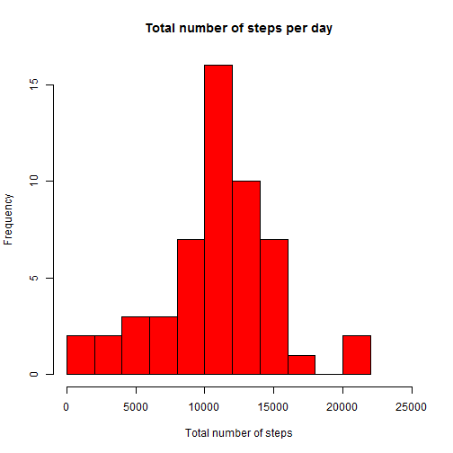
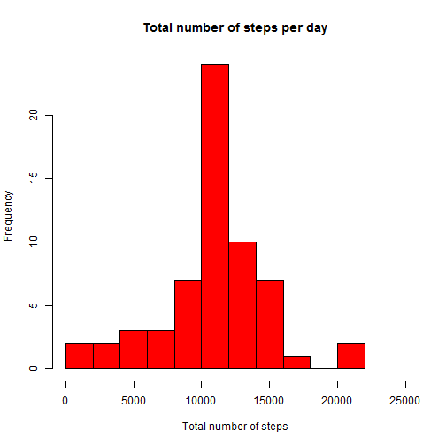
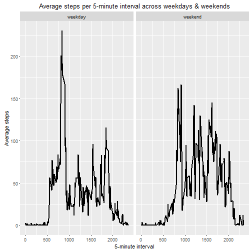

REPORT FOR COURSE PROJECT 1
================================================================================

Warning: Make sure to extract and save the data in your working directory before running this report

Here is the first code chunk, that loads the file into R and preprocesses the 
data.


```r
setwd("C:/Users/ncali/OneDrive/Documentos/Economía/Facu/Coursera/Data Science Specialization/05 Reproducible Research")
file <- paste(getwd(),"/","activity.csv", sep = "")
activity <- read.csv(file)
```
What is mean total number of steps taken per day?
------------------------------------------------

First we can see a histogram of the total steps taken by day. It seems that the distribution of total steps concentrantes on the range 8000-16000 and has a shape similar to a normal distribution:


```r
steps_per_day <- data.frame(tapply(activity$steps, activity$date, sum))
colnames(steps_per_day) <- c("steps_sum")
with(steps_per_day, hist(steps_sum, main = "Total number of steps per day", breaks = 10, xlab = "Total number of steps", col = "red", xlim = c(0,25000)))
```



We can also calculate the mean and median number of steps taken per day. The result confirms or perception from the histogram, since the mean/median are both located in the mentioned range and are approximately equal to each other (equality of the mean and median is a main feature of the normal distribution):


```r
mean_steps_per_day <- mean(steps_per_day$steps_sum, na.rm = TRUE)
median_steps_per_day <- median(steps_per_day$steps_sum, na.rm = TRUE)
mean_steps_per_day
```

```
## [1] 10766.19
```

```r
median_steps_per_day
```

```
## [1] 10765
```

What is the daily average activity pattern?
------------------------------------------------

Another feature of this database that we can analyze is the average activity pattern by measuring range (5 minutes interval).

First we can review the mean steps taken by interval.It seems that the average number of steps is zero in the 0-500 range, then increases suddenly to approximately 50 steps, boosts quickly to the maximum around interval 850, drops suddenly and fluctuates around 50 steps again for most of the day, and finally reduces gradually to zero at the end of the day:


```r
steps_per_interval <- data.frame(tapply(activity$steps, activity$interval, mean, na.rm = TRUE))
steps_per_interval <- data.frame(steps_per_interval, as.double(row.names(steps_per_interval)))
colnames(steps_per_interval) <- c("steps_mean", "interval")
with(steps_per_interval, plot(interval, steps_mean, type = "l", main = "Average Steps by 5 Minutes Interval", xlab = "5 Minutes Interval", ylab = "Average Steps"))
```


We can confirm that the exact interval with the maximum number of steps on average is the 835 interval:


```r
max_steps_per_interval <- subset(steps_per_interval, steps_per_interval$steps_mean == max(steps_per_interval$steps_mean))
max_steps_per_interval
```

```
##     steps_mean interval
## 835   206.1698      835
```

Imputing missing values
-----------------------

However interesting these results may be, we should mention that there is a significant number of observations with missing values on the original database. 

The missing observations on this database amount to 2304, representing approximately 13,1% of the sample:


```r
activity_sum_NAs <- sum(is.na(activity$steps))
activity_sum_NAs
```

```
## [1] 2304
```

```r
activity_sum_NAs_percent <- 100*activity_sum_NAs/nrow(activity)
activity_sum_NAs_percent
```

```
## [1] 13.11475
```

In order to have a more reliable and transparent analysis, I decided to fill in the missing values with the mean for that 5 minute interval, since we have seen in the previous section that there seems to be a common pattern of behavior on the steps taken on average throughout the day:


```r
activity_no_NAs <- subset(activity, is.na(activity$steps) == FALSE)
activity_NAs <- subset(activity, is.na(activity$steps) == TRUE)
activity_NAs <- merge(activity_NAs, steps_per_interval, by="interval")
activity_NAs$steps <- activity_NAs$steps_mean
activity_NAs <- activity_NAs[, 1:3]
activity_filled <- rbind(activity_NAs, activity_no_NAs)
```

Now we recalculate the histogram of the total steps taken by day. We can see that the conclusions we extract from the previous graph seems to remain intact. The only difference worth of mention that I noticed is that the distribution seems now more leptokurtic:


```r
steps_per_day_filled <- data.frame(tapply(activity_filled$steps, activity_filled$date, sum))
colnames(steps_per_day_filled) <- c("steps_sum")
with(steps_per_day_filled, hist(steps_sum, main = "Total number of steps per day", breaks = 10, xlab = "Total number of steps", col = "red", xlim = c(0,25000)))
```



The mean and median number of steps taken per day also remain unchanged:


```r
mean_steps_per_day_filled <- mean(steps_per_day_filled$steps_sum)
median_steps_per_day_filled <- median(steps_per_day_filled$steps_sum)
mean_steps_per_day
```

```
## [1] 10766.19
```

```r
median_steps_per_day
```

```
## [1] 10765
```

Are there differences in activity patterns between weekdays and weekends?
-------------------------------------------------------------------------

One question that we could ask ourselves is if the patterns observed per 5 minutes interval are the same on weekdays and weekends. 

In order to answer this question, first I divide the database in weekdays and weekends: 


```r
activity_filled_days <- cbind(activity_filled, as.POSIXlt(activity_filled$date)$wday)
colnames(activity_filled_days) <- c(colnames(activity_filled), "weekday")
activity_filled_weekdays <- subset(activity_filled_days, activity_filled_days$weekday > 0 & activity_filled_days$weekday < 6)
activity_filled_weekends <- subset(activity_filled_days, activity_filled_days$weekday == 0 | activity_filled_days$weekday == 6)
activity_filled_weekdays <- cbind(activity_filled_weekdays, rep("weekday", nrow(activity_filled_weekdays)))
activity_filled_weekends <- cbind(activity_filled_weekends, rep("weekend", nrow(activity_filled_weekends)))
colnames(activity_filled_weekdays) <- c(colnames(activity_filled_days), "type.of.day")
colnames(activity_filled_weekends) <- c(colnames(activity_filled_days), "type.of.day")
```

Now I create a new variable en each data frame that indicates if the day of the measurement is in fact a weekday or a weekend, and at the end I bind both data frames:


```r
steps_per_interval_weekdays <- data.frame(tapply(activity_filled_weekdays$steps, activity_filled_weekdays$interval, mean))
steps_per_interval_weekdays <- data.frame(steps_per_interval_weekdays, as.double(row.names(steps_per_interval_weekdays)), rep("weekday", nrow(steps_per_interval_weekdays)))
colnames(steps_per_interval_weekdays) <- c("steps_mean", "interval", "type.of.day")

steps_per_interval_weekends <- data.frame(tapply(activity_filled_weekends$steps, activity_filled_weekends$interval, mean))
steps_per_interval_weekends <- data.frame(steps_per_interval_weekends, as.double(row.names(steps_per_interval_weekends)), rep("weekend", nrow(steps_per_interval_weekends)))
colnames(steps_per_interval_weekends) <- c("steps_mean", "interval", "type.of.day")

steps_per_interval_all <- rbind(steps_per_interval_weekdays, steps_per_interval_weekends)
```

Finally, we create a graph to analyze the average steps per 5-minute interval on weekdays and weekends. 

In this graph, we can see that the pattern in weekdays is similar to the one observed before. However, on weekends the average steeps seems to increase later on the day, reaches a lower maximum at 850-950 range, then fluctuates on a sligthtly higher level than weekdays and drops suddenly to zero after interval 2000:


```r
library(ggplot2)
```

```
## Warning: package 'ggplot2' was built under R version 3.3.1
```

```r
g <- ggplot(steps_per_interval_all, aes(interval, steps_mean, group = type.of.day))+geom_line(size = 1)+facet_grid(.~type.of.day)+labs(title = "Average steps per 5-minute interval across weekdays & weekends")+labs(y = "Average steps")+labs(x = "5-minute interval")+labs(colour = "Source Type")
print(g)
```



This is the end of the report for course project 1.

Thanks for your attention!
